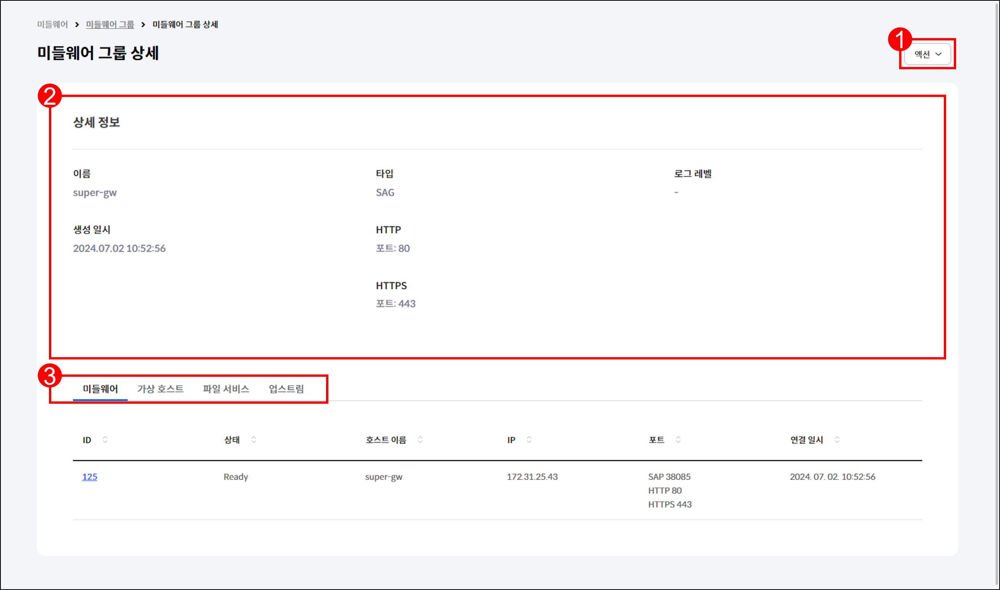
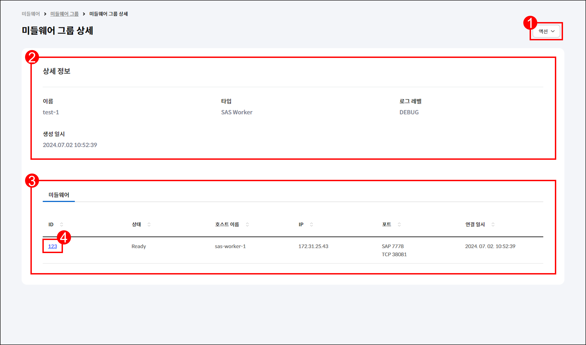
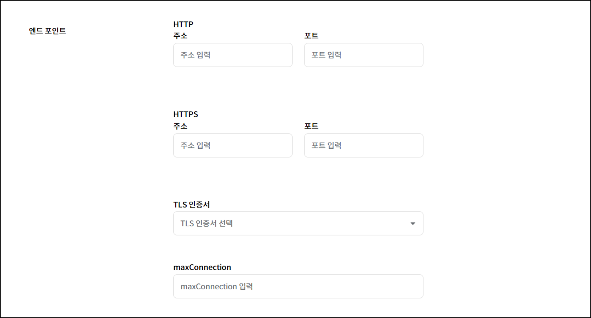
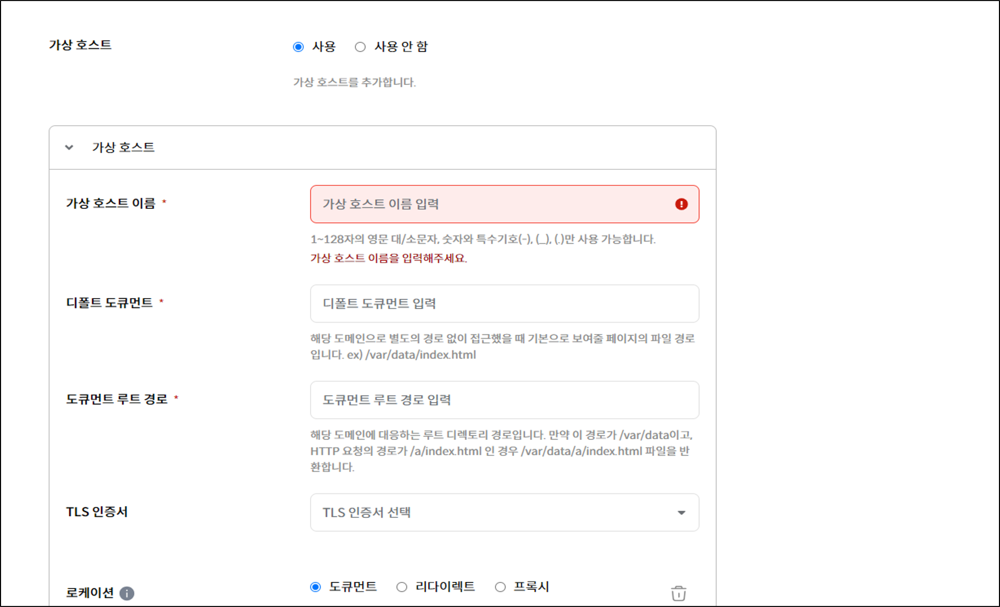
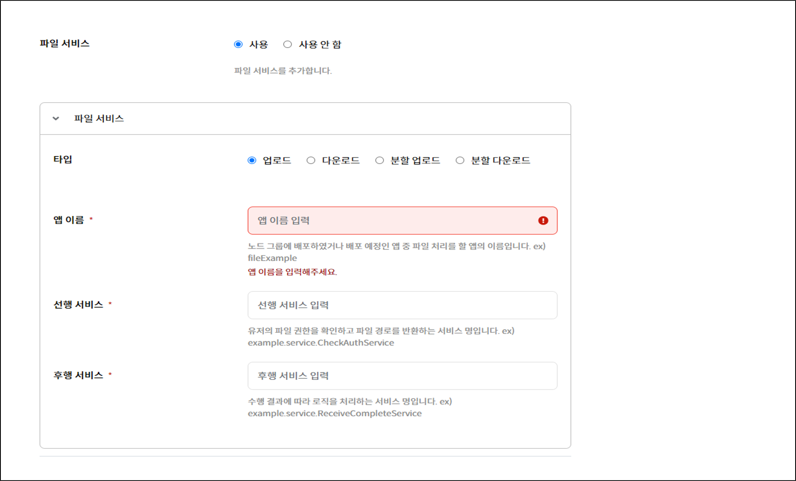
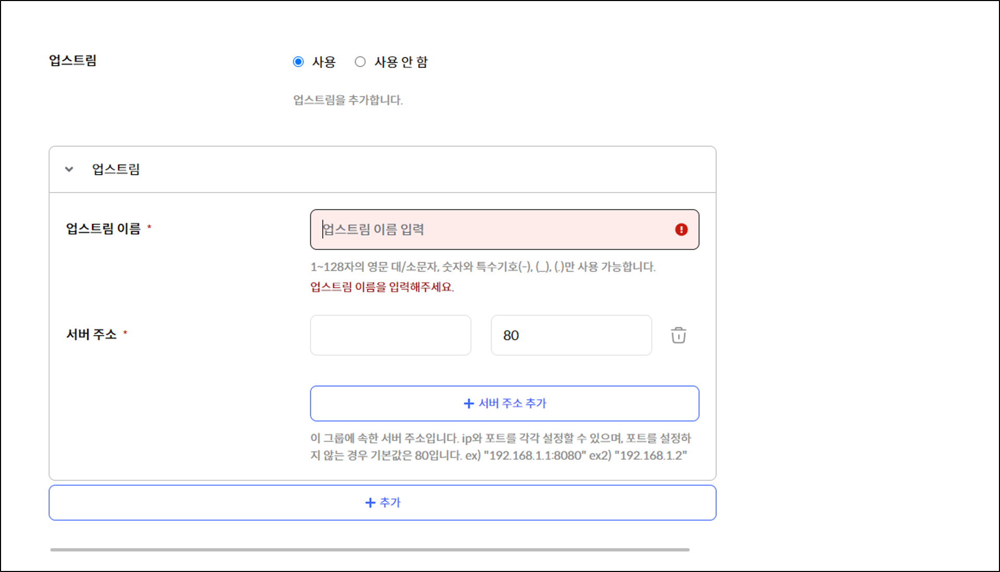

# 2.2 미들웨어 그룹

## 2.2.1 미들웨어 그룹 조회

\[그림 2.2.1] 미들웨어 그룹 조회 페이지

1. 메뉴 영역에서 `미들웨어` > `미들웨어 그룹`을 클릭합니다.
2.  `MiddleWareMaster`와 연결된 미들웨어 그룹을 조회할 수 있습니다.&#x20;

    <table><thead><tr><th width="150">항목</th><th width="326">설명</th><th>예시</th></tr></thead><tbody><tr><td>이름</td><td>미들웨어 그룹의 이름</td><td>-</td></tr><tr><td>타입</td><td>연결된 미들웨어의 타입</td><td><code>SAG</code>, <code>SAS Master</code>, <code>SAS Worker</code>, <code>WAS (Tomcat)</code>,  <code>WAS (Django)</code></td></tr><tr><td>미들웨어 수</td><td>그룹에 속한 미들웨어의 수</td><td>-</td></tr><tr><td>생성 일시</td><td>미들웨어 그룹의 생성 일시</td><td>yyyy.MM.dd HH.mm.ss</td></tr></tbody></table>
3. 드롭다운 메뉴에서 항목을 선택하고 검색어를 입력하여 미들웨어 그룹을 조회할 수 있습니다.
4. 미들웨어 그룹의 이름을 클릭하면 해당 미들웨어 그룹의 상세 페이지로 이동합니다.

***

## 2.2.2 미들웨어 그룹 상세

1. 메뉴 영역에서 `미들웨어` > `미들웨어 그룹`을 클릭합니다.
2. 상세 정보를 확인할 미들웨어 그룹의 이름을 클릭합니다.
3. 미들웨어 그룹의 타입에 따라 서로 다른 탭이 표시됩니다.
   * [SAG 타입](2.2-node-group.md#sag)
   * [SAS Worker 타입](2.2-node-group.md#sas-worker)

### SAG 타입

<figure><figcaption>
[그림 2.2.2] <code>SAG</code> 타입 미들웨어 그룹 상세 조회 페이지
</figcaption></figure>

1. `액션` > `편집`을 클릭하면 미들웨어 그룹의 편집 페이지로 이동합니다.
2.  `SAG` 타입 미들웨어 그룹의 상세 정보를 조회할 수 있습니다.&#x20;

    <table><thead><tr><th width="120">항목</th><th width="318">설명</th><th>예시</th></tr></thead><tbody><tr><td>이름</td><td>미들웨어 그룹의 이름</td><td>-</td></tr><tr><td>타입</td><td>미들웨어 그룹의 타입</td><td><code>SAG</code>, <code>SAS Master</code>,  <code>SAS Worker</code>, <code>WAS (Tomcat)</code>, <code>WAS (Django)</code></td></tr><tr><td>로그 레벨</td><td>미들웨어 그룹에 설정된 로그 레벨</td><td><code>INFO</code>, <code>ERROR</code>, <code>DEBUG</code>, <code>TRACE</code></td></tr><tr><td>생성 일시</td><td>미들웨어 그룹의 생성 일시</td><td>yyyy.MM.dd HH.mm.ss</td></tr><tr><td>HTTP</td><td>설정된 HTTP 포트</td><td>-</td></tr><tr><td>HTTPS</td><td>설정된 HTTPS 포트</td><td>-</td></tr></tbody></table>
3. `SAG` 타입의 경우, 다음과 같은 탭을 제공합니다.&#x20;
   * [미들웨어 탭](2.2-node-group.md#undefined)
   * [가상 호스트 탭](2.2-node-group.md#undefined-1)
   * [파일 서비스 탭](2.2-node-group.md#undefined-2)
   * [업스트림 탭](2.2-node-group.md#undefined-3)

#### 미들웨어 탭

\[그림 2.2.3] `SAG` 타입 미들웨어 그룹 상세 조회 페이지 내 미들웨어 탭

1.  연결된 미들웨어를 조회할 수 있습니다.&#x20;

    <table><thead><tr><th width="145">항목</th><th width="325">설명</th><th>예시</th></tr></thead><tbody><tr><td>ID</td><td>미들웨어 그룹에 속한 미들웨어 ID</td><td>-</td></tr><tr><td>상태</td><td>미들웨어와 <code>MiddleWareMaster</code>의  연결 상태</td><td><code>Ready</code>, <code>Not Ready</code></td></tr><tr><td>호스트 이름</td><td>미들웨어의 호스트 이름</td><td>-</td></tr><tr><td>IP</td><td>미들웨어가 사용하는 IP</td><td>x.x.x.x</td></tr><tr><td>포트</td><td>미들웨어가 사용하는 포트</td><td>SAP 38085  HTTP 80  HTTPS 443</td></tr><tr><td>연결 일시</td><td>미들웨어와 <code>MiddleWareMaster</code>의   연결 일시</td><td>yyyy.MM.dd HH.mm.ss</td></tr></tbody></table>
2. 미들웨어의 ID를 클릭하면 해당 미들웨어의 상세 페이지로 이동합니다.

#### 가상 호스트 탭

\[그림 2.2.4] `SAG` 타입 미들웨어 그룹 상세 조회 페이지 내 가상 호스트 탭

1.  게이트웨이에서 사용할 가상 호스트를 조회할 수 있습니다.&#x20;

    <table><thead><tr><th width="217">항목</th><th>설명</th></tr></thead><tbody><tr><td>가상 호스트 이름</td><td>SAG에 사용할 도메인</td></tr><tr><td>디폴트 도큐먼트</td><td>도메인으로 접속 시 사용할 디폴트 파일</td></tr><tr><td>파일 디렉토리 경로</td><td>도메인 사용 시 매핑할 도큐먼트 경로</td></tr><tr><td>TLS 인증서</td><td>도메인 사용 시 사용할 인증서</td></tr><tr><td>로케이션 수</td><td>도메인 하위 경로에 대한 정책으로 리다이렉트 및  리버스프록시 기능 지원</td></tr></tbody></table>
2.  로케이션 수를 클릭하여 라우팅 정보를 조회할 수 있습니다. 타입에 대한 설명은 아래 표를 참고하세요.

    <table><thead><tr><th width="142">타입</th><th>설명</th></tr></thead><tbody><tr><td>도큐먼트</td><td>특정 경로에 대해 제공되는 파일 경로</td></tr><tr><td>리다이렉트</td><td>특정 경로에 대해 규칙에 따라 리다이렉트되는 경로</td></tr><tr><td>프록시</td><td>특정 경로에 대해 요청이 전달되는 URL</td></tr></tbody></table>

#### 파일 서비스 탭

\[그림 2.2.5] `SAG` 타입 미들웨어 그룹 상세 조회 페이지 내 파일 서비스 탭

파일 처리 시 사용되는 앱을 조회할 수 있습니다.

<table><thead><tr><th width="143">항목</th><th width="339">설명</th><th>예시</th></tr></thead><tbody><tr><td>앱 이름</td><td>파일 처리 시 사용되는 앱의 이름</td><td>-</td></tr><tr><td>타입</td><td>파일 처리 타입</td><td><code>upload</code>, <code>download</code>,  <code>chunkedUpload</code>,  <code>ChunkedDownload</code></td></tr><tr><td>선행 서비스</td><td>파일 처리 전에 동작하는 서비스</td><td>-</td></tr><tr><td>후행 서비스</td><td>파일 처리 후에 동작하는 서비스</td><td>-</td></tr></tbody></table>

#### 업스트림 탭

\[그림 2.2.6] `SAG` 타입 미들웨어 그룹 상세 조회 페이지 내 업스트림 탭

프록시 기능에 사용되는 업스트림 서버를 조회할 수 있습니다.&#x20;

<table><thead><tr><th width="191">항목</th><th>설명</th></tr></thead><tbody><tr><td>업스트림 이름</td><td>업스트림 서버의 이름</td></tr><tr><td>서버 주소</td><td>실제 주소</td></tr></tbody></table>

### SAS Worker 타입

<figure><figcaption>
[그림 2.2.7] <code>SAS Worker</code> 타입 미들웨어 그룹 상세 조회 페이지
</figcaption></figure>

1. `액션` > `편집`을 클릭하면 미들웨어 그룹의 편집 페이지로 이동합니다.
2.  `SAS Worker` 타입 미들웨어 그룹의 상세 정보를 조회할 수 있습니다.&#x20;

    <table><thead><tr><th width="131">항목</th><th width="340">설명</th><th>예시</th></tr></thead><tbody><tr><td>이름</td><td>미들웨어 그룹의 이름</td><td>-</td></tr><tr><td>타입</td><td>미들웨어 그룹의 타입</td><td><code>SAG</code>, <code>SAS Master</code>,  <code>SAS Worker</code>, <code>WAS (Tomcat)</code>, <code>WAS (Django)</code></td></tr><tr><td>로그 레벨</td><td>미들웨어 그룹에 설정된 로그 레벨</td><td><code>INFO</code>, <code>ERROR</code>, <code>DEBUG</code>, <code>TRACE</code></td></tr><tr><td>생성 일시</td><td>미들웨어 그룹의 생성 일시</td><td>yyyy.MM.dd HH.mm.ss</td></tr></tbody></table>
3.  `미들웨어` 탭에서는 다음과 같은 항목을 조회할 수 있습니다.

    <table><thead><tr><th width="150">항목</th><th width="323">설명</th><th>예시</th></tr></thead><tbody><tr><td>ID</td><td>미들웨어 그룹에 속한 미들웨어 ID</td><td>-</td></tr><tr><td>상태</td><td>미들웨어와 <code>MiddleWareMaster</code>의  연결 상태</td><td><code>Ready</code>, <code>Not Ready</code></td></tr><tr><td>호스트 이름</td><td>미들웨어의 호스트 이름</td><td>-</td></tr><tr><td>IP</td><td>미들웨어가 사용하는 IP</td><td>x.x.x.x</td></tr><tr><td>포트</td><td>미들웨어가 사용하는 포트</td><td>SAP 8282 TCP 38285</td></tr><tr><td>연결 일시</td><td>미들웨어와 <code>MiddleWareMaster</code>가  연결된 일시</td><td>yyyy.MM.dd HH.mm.ss</td></tr></tbody></table>
4. 미들웨어의 ID를 클릭하면 해당 미들웨어의 상세 페이지로 이동합니다.

***

## 2.2.3 미들웨어 그룹 편집


**안내**

미들웨어 그룹 편집은 `SAG` 타입만 지원합니다.


1. 메뉴 영역에서 `미들웨어` > `미들웨어 그룹`을 클릭합니다.
2. 편집할 미들웨어 그룹에 체크한 후 `편집`을 클릭합니다.
3. 입력 항목에 관한 설명은 다음을 참고하세요.
   * [엔드 포인트](2.2-node-group.md#undefined)
   * [가상 호스트](2.2-node-group.md#undefined-1)
   * [파일 서비스](2.2-node-group.md#undefined-2)
   * [업스트림](2.2-node-group.md#undefined-3)

### 엔드 포인트

<figure><figcaption>
[그림 2.2.8] <code>SAG</code> 타입 미들웨어 그룹 편집 페이지 내 엔드 포인트 입력란
</figcaption></figure>

엔드 포인트 정보를 편집할 수 있습니다.

<table><thead><tr><th width="198">항목</th><th width="371">설명</th><th>예시</th></tr></thead><tbody><tr><td>HTTP 주소, 포트 </td><td>HTTP 처리 시 사용할 엔드 포인트 IP, 포트</td><td>192.168.1.1 8080</td></tr><tr><td>HTTPS 주소, 포트 </td><td>HTTPS 처리 시 사용할 엔드 포인트 IP, 포트</td><td>192.168.1.1 443</td></tr><tr><td>TLS 인증서 </td><td>HTTPS 처리 시 사용할 인증서</td><td>-</td></tr><tr><td>maxConnection </td><td>최대 연결 수</td><td>1000</td></tr></tbody></table>

### 가상 호스트

<figure><figcaption>
[그림 2.2.9] <code>SAG</code> 타입 미들웨어 그룹 편집 페이지 내 가상 호스트 입력란
</figcaption></figure>

1.  `사용`을 선택하면 가상 호스트 정보를 편집할 수 있습니다.&#x20;

    <table><thead><tr><th width="199">항목</th><th>설명</th></tr></thead><tbody><tr><td>가상 호스트 이름 <mark style="color:red;"><strong>*</strong></mark></td><td>SAG에 사용할 도메인</td></tr><tr><td>디폴트 도큐먼트 <mark style="color:red;"><strong>*</strong></mark></td><td>도메인으로 접속 시 사용할 디폴트 파일</td></tr><tr><td>파일 디렉토리 경로 <mark style="color:red;"><strong>*</strong></mark></td><td>도메인 사용 시 매핑할 도큐먼트 경로</td></tr><tr><td>TLS 인증서 <mark style="color:red;"><strong>*</strong></mark></td><td>도메인 사용 시 사용할 인증서</td></tr><tr><td>로케이션 <mark style="color:red;"><strong>*</strong></mark></td><td>도메인 하위 경로에 대한 정책</td></tr></tbody></table>
2. 로케이션의 경우, 타입을 지정할 수 있습니다. 타입별 입력 항목은 다음과 같습니다.
   *   `도큐먼트` 타입

       <table><thead><tr><th width="178">항목</th><th>설명</th></tr></thead><tbody><tr><td>경로 <mark style="color:red;"><strong>*</strong></mark></td><td>가상 호스트에서 사용할 경로</td></tr><tr><td>도큐먼트 <mark style="color:red;"><strong>*</strong></mark></td><td>지정한 경로로 요청이 들어왔을 때 반환할 페이지의 파일 경로</td></tr></tbody></table>
   *   `리다이렉트` 타입

       <table><thead><tr><th width="177">항목</th><th>설명</th></tr></thead><tbody><tr><td>경로 <mark style="color:red;"><strong>*</strong></mark></td><td>가상 호스트에서 사용할 경로</td></tr><tr><td>사용자 에이전트 <mark style="color:red;"><strong>*</strong></mark></td><td>리다이렉트가 동작할 에이전트</td></tr><tr><td>리다이렉트 코드 <mark style="color:red;"><strong>*</strong></mark></td><td>리다이렉트 시 반환할 상태 코드</td></tr><tr><td>리다이렉트 URL <mark style="color:red;"><strong>*</strong></mark></td><td>리다이렉트 시 반환할 경로</td></tr></tbody></table>
   *   `프록시` 타입

       <table><thead><tr><th width="179">항목</th><th>설명</th></tr></thead><tbody><tr><td>경로 <mark style="color:red;"><strong>*</strong></mark></td><td>가상 호스트에서 사용할 경로</td></tr><tr><td>프록시 <mark style="color:red;"><strong>*</strong></mark></td><td>설정한 경로로 요청이 들어왔을 때 요청을 전달할 주소</td></tr></tbody></table>

### 파일 서비스

<figure><figcaption>
[그림 2.2.10] <code>SAG</code> 타입 미들웨어 그룹 편집 페이지 내 파일 서비스 입력란
</figcaption></figure>

`사용`을 선택하면 파일 서비스 정보를 편집할 수 있습니다.&#x20;

<table><thead><tr><th width="147">항목</th><th width="349">설명</th><th>예시</th></tr></thead><tbody><tr><td>타입 <mark style="color:red;"><strong>*</strong></mark></td><td>파일 서비스의 타입</td><td><code>업로드</code>, <code>다운로드</code>, <code>분할 업로드</code>, <code>분할 다운로드</code></td></tr><tr><td>앱 이름 <mark style="color:red;"><strong>*</strong></mark></td><td>파일 서비스 동작 시 사용되는 앱의 이름</td><td>-</td></tr><tr><td>선행 서비스 <mark style="color:red;"><strong>*</strong></mark></td><td>파일 서비스 동작 전에 동작하는 서비스</td><td>example.service.PreService</td></tr><tr><td>후행 서비스 <mark style="color:red;"><strong>*</strong></mark></td><td>파일 서비스 동작 후에 동작하는 서비스</td><td>example.service.PostService</td></tr></tbody></table>

### 업스트림

<figure><figcaption>
[그림 2.2.11] <code>SAG</code> 타입 미들웨어 그룹 편집 페이지 내 업스트림 입력란
</figcaption></figure>

`사용`을 선택하면 업스트림 정보를 편집할 수 있습니다.&#x20;

<table><thead><tr><th width="172">항목</th><th width="336">설명</th><th>예시</th></tr></thead><tbody><tr><td>업스트림 이름 <mark style="color:red;"><strong>*</strong></mark></td><td>가상 호스트에서 사용할 업스트림의 이름</td><td>-</td></tr><tr><td>서버 주소 <mark style="color:red;"><strong>*</strong></mark></td><td>업스트림 서버 IP / 포트</td><td>192.168.1.2 / 80</td></tr></tbody></table>
