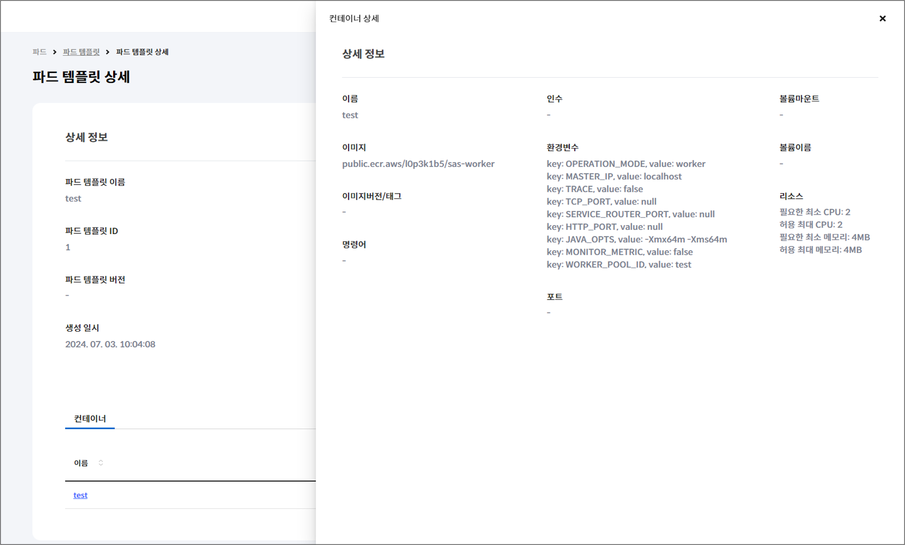

# 3.3 파드 템플릿

## 3.3.1 파드 템플릿 생성

1. 메뉴 영역에서 `파드` > `파드 템플릿`을 클릭합니다.
2. 파드 템플릿 페이지가 열리면 `생성`을 클릭합니다.

\[그림 3.3.1] 파드 템플릿 생성 페이지

3.  생성할 파드 템플릿의 정보를 입력합니다.&#x20;

    <table><thead><tr><th width="180">항목</th><th>설명</th></tr></thead><tbody><tr><td>파드 템플릿 생성 <mark style="color:red;">*</mark></td><td>
파드 템플릿 생성 방법
<ul><li><code>신규 생성</code>: 새로운 파드 템플릿 생성</li><li><code>불러 오기</code>: 기존 파드 템플릿에 버전 추가</li></ul></td></tr><tr><td>이름</td><td>파드 템플릿의 이름</td></tr><tr><td>네트워크</td><td>사용할 네트워크</td></tr></tbody></table>
4.  파드에 사용할 컨테이너의 정보를 입력합니다.&#x20;

    <table><thead><tr><th width="164">항목</th><th width="373">설명</th><th>예시</th></tr></thead><tbody><tr><td>컨테이너 이름 <mark style="color:red;"><strong>*</strong></mark></td><td>컨테이너의 이름</td><td>-</td></tr><tr><td>이미지 <mark style="color:red;"><strong>*</strong></mark></td><td>컨테이너에 사용할 이미지</td><td>-</td></tr><tr><td>인증 정보</td><td>Private 레지스트리에서 이미지를 가져올 때  사용할 인증 정보(사용자 이름, 패스워드)</td><td>-</td></tr><tr><td>명령어</td><td>ENTRYPOINT, 컨테이너 기동 시 실행할  명령어</td><td>["sh", "-c"]</td></tr><tr><td>인수 > 값</td><td>CMD, 컨테이너 기동 시 사용할 명령어</td><td>--config config.yaml</td></tr><tr><td>환경 변수</td><td>컨테이너에 설정할 환경 변수(키, 값)</td><td>-</td></tr><tr><td>포트</td><td>컨테이너에서 노출할 포트 (컨테이너 포트, 호스트 포트)</td><td>-</td></tr><tr><td>볼륨 마운트</td><td>컨테이너에 마운트할 볼륨</td><td><code>empty Dir</code>, <code>호스트 패스</code></td></tr><tr><td>리소스</td><td>컨테이너에 할당할 컴퓨팅 리소스 (CPU, 메모리)</td><td>-</td></tr></tbody></table>
5. `취소`를 클릭하면 파드 템플릿 생성을 중단하고 파드 템플릿 조회 페이지로 돌아갑니다.
6. `저장`을 클릭하면 입력한 내용으로 파드 템플릿을 생성합니다.

***

## 3.3.2 파드 템플릿 조회

\[그림 3.3.2] 파드 템플릿 조회 페이지

1. 메뉴 영역에서 `파드` > `파드 템플릿`을 클릭합니다.
2.  파드 템플릿을 조회할 수 있습니다.&#x20;

    <table><thead><tr><th width="165">항목</th><th>설명</th></tr></thead><tbody><tr><td>이름</td><td>파드 템플릿의 이름</td></tr><tr><td>파드 정의 ID</td><td>파드 템플릿 ID</td></tr><tr><td>생성 일시</td><td>파드 템플릿의 생성 일시</td></tr></tbody></table>
3. 드롭다운 메뉴에서 항목을 선택하고 검색어를 입력하여 파드 템플릿을 검색할 수 있습니다.
4. 파드 템플릿의 이름을 클릭하면 해당 파드 템플릿의 상세 페이지로 이동합니다.

***

## 3.3.3 파드 템플릿 상세

1. 메뉴 영역에서 `파드` > `파드 템플릿`을 클릭합니다.
2. 상세 정보를 확인할 파드 템플릿의 이름을 클릭합니다.

\[그림 3.3.3] 파드 템플릿 상세 페이지

3. `액션` > `삭제`를 클릭하면 해당 파드 템플릿의 삭제 창이 표시됩니다.
4.  파드 템플릿의 상세 정보를 조회할 수 있습니다.&#x20;

    <table><thead><tr><th width="176">항목</th><th>설명</th></tr></thead><tbody><tr><td>파드 템플릿 이름</td><td>파드 템플릿의 이름</td></tr><tr><td>파드 템플릿 ID</td><td>파드 템플릿 ID</td></tr><tr><td>파드 템플릿 버전</td><td>파드 템플릿의 버전</td></tr><tr><td>생성 일시</td><td>파드 템플릿의 생성 일시</td></tr></tbody></table>
5. `컨테이너` 탭에서는 파드에 사용되는 컨테이너 목록을 조회할 수 있습니다.
6.  컨테이너의 이름을 클릭하면 컨테이너 상세 정보 창이 표시됩니다.&#x20;

    <figure><figcaption>
[그림 3.3.4] 파드 템플릿 상세 조회 페이지 내 컨테이너 상세 창
</figcaption></figure>

    <table><thead><tr><th width="172">항목</th><th width="291">설명</th><th>예시</th></tr></thead><tbody><tr><td>이름</td><td>컨테이너 이름</td><td>-</td></tr><tr><td>이미지</td><td>컨테이너에 사용할 이미지</td><td>-</td></tr><tr><td>이미지버전/태그</td><td>이미지의 버전/태그</td><td>-</td></tr><tr><td>명령어</td><td>ENTRYPOINT, 컨테이너 기동 시  실행할 명령어</td><td>["sh", "-c"]</td></tr><tr><td>인수</td><td>CMD, 컨테이너 기동 시 사용할  명령어</td><td>config</td></tr><tr><td>환경변수</td><td>컨테이너에 설정할 환경 변수 (키, 값)</td><td>LABEL: test</td></tr><tr><td>포트</td><td>컨테이너에서 노출할 포트</td><td>컨테이너 포트: 80 호스트 포트: 81</td></tr><tr><td>볼륨마운트</td><td>컨테이너에 마운트할 볼륨</td><td>호스트 패스: /tmp 컨테이너 패스: /container/tmp</td></tr><tr><td>볼륨이름</td><td>마운트된 볼륨 이름</td><td>-</td></tr><tr><td>리소스</td><td>컨테이너에 할당할 컴퓨팅 리소스</td><td>필요한 최소 CPU: 1 허용 최대 CPU: 1 필요한 최소 메모리: 128MB 허용 최대 메모리: 128MB</td></tr></tbody></table>

***

## 3.3.4 파드 템플릿 삭제

1. 메뉴 영역에서 `파드` > `파드 템플릿`을 클릭합니다.
2. 삭제할 파드 템플릿에 체크한 후 `삭제`를 클릭합니다.

\[그림 3.3.5] 파드 템플릿 삭제 창

3. `취소`를 클릭하면 파드 템플릿 삭제를 중단하고 파드 템플릿 조회 페이지로 돌아갑니다.
4. `삭제`를 클릭하면 해당 파드 템플릿을 삭제합니다.
