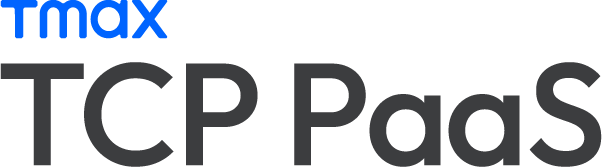

# 이 안내서에 대하여

<figure><figcaption></figcaption></figure>

## 개정 이력

<table><thead><tr><th width="118" align="center">안내서 버전</th><th width="126" align="center">개정 일자</th><th width="250" align="center">개정 내용</th><th width="254" align="center">작성자</th></tr></thead><tbody><tr><td align="center">1.0.0</td><td align="center">2024.06.07</td><td align="center">최초 배포</td><td align="center">티맥스클라우드 PM1사업본부 QA실</td></tr><tr><td align="center">1.0.1</td><td align="center"></td><td align="center">
표현 및 표기 통일,  

콘텐츠 최신화
</td><td align="center">티맥스클라우드 PM1사업본부 QA실 이채윤</td></tr></tbody></table>

***

## 안내서 정보

> 안내서 제목: TCP PaaS 사용자 안내서 v1
>
> 발행일:&#x20;
>
> 안내서 버전: 1.0.1

***

## 버전 정보

이 문서는 아래의 제품 및 버전을 기준으로 작성되었습니다.

> SuperAppServer: 1.8.0
>
> SuperAppGateway: 1.8.0
>
> GOM Agent: 0.1.5
>
> Network-Pod: 0.1.5
>
> HOM: 0.3.6
>
> Client: 0.1.1

***

#### Copyright Notice

Copyright 2024 TmaxCloud Co., Ltd. All Rights Reserved. \
대한민국 경기도 성남시 분당구 황새울로258번길 29, 티맥스수내타워 7층 (우: 13595)\
홈페이지: [https://www.tmax.co.kr/tmaxcloud](https://www.tmax.co.kr/tmaxcloud)

***

#### Restricted Rights Legend

All TmaxCloud Software and documents are protected by copyright laws and international convention. TmaxCloud software and documents are made available under the terms of the TmaxCloud License Agreement and this document may only be distributed or copied in accordance with the terms of this agreement. No part of this document may be transmitted, copied, deployed, or reproduced in any form or by any means, electronic, mechanical, or optical, without the prior written consent of TmaxCloud Co., Ltd. Nothing in this software document and agreement constitutes a transfer of intellectual property rights regardless of whether or not such rights are registered) or any rights to TmaxCloud trademarks, logos, or any other brand features. This document is for information purposes only. The company assumes no direct or indirect responsibilities for the contents of this document, and does not guarantee that the information contained in this document satisfies certain legal or commercial conditions. The information contained in this document is subject to change without prior notice due to product upgrades or updates. The company assumes no liability for any errors in this document.&#x20;

이 소프트웨어 사용설명서의 내용과 프로그램은 저작권법과 국제 조약에 의해서 보호받고 있습니다. 사용설명서의 내용과 여기에 설명된 프로그램은 TmaxCloud Co., Ltd.와의 사용권 계약 하에서만 사용이 가능하며, 사용설명서는 사용권 계약의 범위 내에서만 배포 또는 복제할 수 있습니다. 이 사용설명서의 전부 또는 일부 분을 TmaxCloud의 사전 서면 동의 없이 전자, 기계, 녹음 등의 수단을 사용하여 전송, 복제, 배포, 2차적 저작물 작성 등의 행위를 하여서는 안 됩니다. 이 소프트웨어 사용설명서와 프로그램의 사용권 계약은 어떠한 경우에도 사용설명서 및 프로그램과 관련된 지적 재산권(등록 여부를 불문)을 양도하는 것으로 해석되지 아니하며, 브랜드나 로고, 상표 등을 사용할 권한을 부여하지 않습니다. 사용설명서는 오로지 정보의 제공만을 목적으로 하고, 이로 인한 계약상의 직접적 또는 간접적 책임을 지지 아니하며, 사용설명서 상의 내용은 법적 또는 상업적인 특정한 조건을 만족시키는 것을 보장하지는 않습니다. 사용설명서의 내용은 제품의 업그레이드나 수정에 따라 그 내용이 예고 없이 변경될 수 있으며, 내용상의 오류가 없음을 보장하지 아니합니다.

<figure><figcaption></figcaption></figure>
